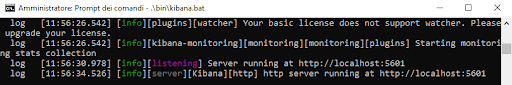
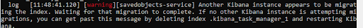
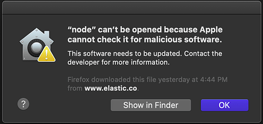

# Setup

- [Setup](#setup)
    - [Setup: download di Elasticsearch e Kibana](#setup-download-di-elasticsearch-e-kibana)
    - [Setup: estrazione](#setup-estrazione)
    - [Setup: avvio di Elasticsearch e Kibana](#setup-avvio-di-elasticsearch-e-kibana)
    - [Setup: Primo avvio avvenuto con successo?](#setup-primo-avvio-avvenuto-con-successo)

### Setup: download di Elasticsearch e Kibana

| | |
|---------|-------------------------------------------------------------------------------------------------------------------------------------------------------------------------------------|
| Linux   | https://artifacts.elastic.co/downloads/elasticsearch/elasticsearch-7.10.0-linux-x86_64.tar.gz https://artifacts.elastic.co/downloads/kibana/kibana-7.10.0-linux-x86_64.tar.gz    |
| Mac     | https://artifacts.elastic.co/downloads/elasticsearch/elasticsearch-7.10.0-darwin-x86_64.tar.gz https://artifacts.elastic.co/downloads/kibana/kibana-7.10.0-darwin-x86_64.tar.gz  |
| Windows | https://artifacts.elastic.co/downloads/elasticsearch/elasticsearch-7.10.0-windows-x86_64.zip https://artifacts.elastic.co/downloads/kibana/kibana-7.10.0-windows-x86_64.zip      |
| Docker  | `docker pull docker.elastic.co/elasticsearch/elasticsearch:7.10.0` `docker pull docker.elastic.co/kibana/kibana:7.10.0`                                                              |

___

### Setup: estrazione

- Per semplicità estrarremo gli archivi all’interno della cartella `rios-es-workshop-2020`
- Per velocizzare l’estrazione degli archivi su Windows è consigliato l’utilizzo di 7-Zip

| | |
|---------|----------------------------------------------------------------------------------------------------------|
| Linux   | `tar -xzvf elasticsearch-7.10.0-linux-x86_64.tar.gz` `tar -xzvf kibana-7.10.0-linux-x86_64.tar.gz`        |
| Mac     | `tar -xzvf elasticsearch-7.10.0-darwin-x86_64.tar.gz` `tar -xzvf kibana-7.10.0-darwin-x86_64.tar.gz`      |
| Windows | Estrarre il contenuto di: `elasticsearch-7.10.0-windows-x86_64.zip` `kibana-7.10.0-windows-x86_64.zip` |
| Docker  | Nessuna operazione necessaria                                                                            |

___

### Setup: avvio di Elasticsearch e Kibana

- Su Windows è consigliato l’utilizzo del prompt dei comandi eseguito come Amministratore
- Aprire quindi due terminali / prompt, uno per Elasticsearch, l’altro per Kibana
- Dirigersi con un browser su http://localhost:9200 per vedere se Elasticsearch è raggiungibile

| | |
|--------------------------------------|------------------------------------------------------------------------------------------------------------|
| (Step 1) Docker su Linux/Mac/Windows | `sudo sysctl -w vm.max_map_count=262144`      ([ulteriori info](https://www.elastic.co/guide/en/elasticsearch/reference/7.10/docker.html#_set_vm_max_map_count_to_at_least_262144))                                               |
| (Step 2) Linux                       | `cd elasticsearch-7.10.0/ && ./bin/elasticsearch` `cd kibana-7.10.0-linux-x86_64/ && ./bin/kibana`          |
| (Step 2) Mac                         | `cd elasticsearch-7.10.0/ && ./bin/elasticsearch` `cd kibana-7.10.0-darwin-x86_64/ && ./bin/kibana`         |
| (Step 2) Windows                     | `cd elasticsearch-7.10.0/ && .\bin\elasticsearch.bat` `cd kibana-7.10.0-windows-x86_64 && .\bin\kibana.bat` |
| (Step 2) Docker                      | `cd rios-es-workshop-2020 && docker-compose up -d`                                                           |

___

### Setup: Primo avvio avvenuto con successo?

- Dirigersi con un browser su http://localhost:5601 per vedere se Kibana è raggiungibile
- Se non ottenete errori, congratulazioni!
- Se ottenete un messaggio con scritto "Kibana server is not ready yet", controllate che sul terminale / prompt dei comandi di Kibana compaiano i messaggi come il seguente (per consultare i log di Kibana con docker-compose: `docker-compose logs kibana`)

- Se sul terminale / prompt di Kibana ottenete un messaggio di questo tipo:

allora interrompete l’esecuzione di Elasticsearch e eliminate la cartella "data" presente nella cartella elasticsearch-7.10.0 (Attenzione: l’eliminazione della cartella “data” comporta l’eliminazione di tutti i dati presenti su Elasticsearch)

- Se avete problemi ad avviare Kibana su Mac OS dove `node` non può essere aperto per motivi di sicurezza

allora avete modi diversi di risolvere:

1- System Preferences > Security and Privacy > Developer Tools. Modificare per permettere al terminale di eseguire software che non soddisfa le preferenze di sicurezza del sistema. 

2- Fare click su "Show in Finder", eseguire `node`, dare i permessi di sicurezza a `node`, dopodiché provare a riavviare Kibana

