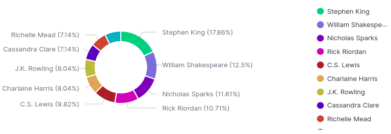
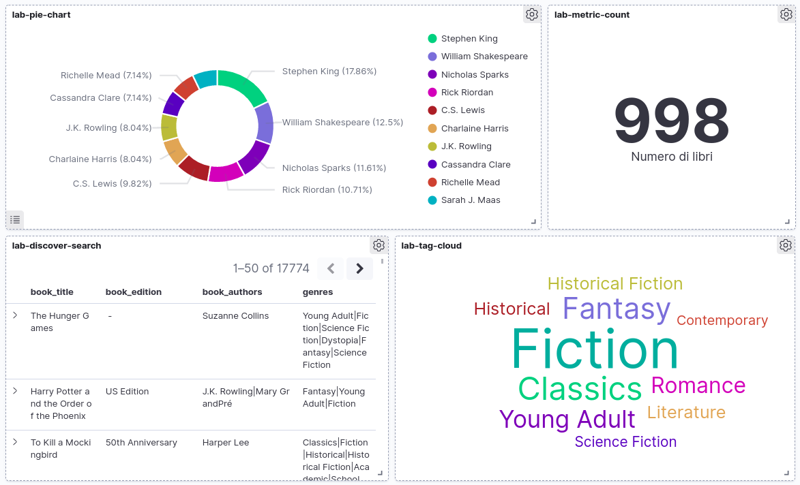

# Soluzioni laboratorio ES Workshop
- [Soluzioni laboratorio ES Workshop](#soluzioni-laboratorio-es-workshop)
    - [LAB - Indicizzazione](#lab---indicizzazione)
    - [LAB - Modellizzazione](#lab---modellizzazione)
    - [LAB - Ricerca](#lab---ricerca)
    - [LAB - Analisi](#lab---analisi)
    - [LAB - Analisi con Kibana](#lab---analisi-con-kibana)

### LAB - Indicizzazione

- Dal Discover, creare una vista e salvarla con i seguenti fields: book_title , book_edition, book_authors, genres

Aprire il menu laterale, recarsi su Discover. 

Fare click su "New", sotto a "+ Add filter" fare click sul menu a tendina e poi su "workshop-books".

Su "Available fields" fare click su "+" accanto a "book_title", "book_edition", "book_authors" e "genres" (bisogna passare sopra al nome del campo per far comparire il pulsante "+").

Fare click su "Save" e inserire come titolo "lab-discover-search", poi click su "Save".

### LAB - Modellizzazione

- Creazione di un indice `workshop-books-2` con lo stesso mapping di `workshop-books`:

```
PUT workshop-books-2
{
  "mappings": {
    "properties": {
      "book_authors": {
        "type": "text"
      },
      "book_desc": {
        "type": "text"
      },
      "book_edition": {
        "type": "text"
      },
      "book_format": {
        "type": "keyword"
      },
      "book_isbn": {
        "type": "double"
      },
      "book_pages": {
        "type": "keyword"
      },
      "book_rating": {
        "type": "double"
      },
      "book_rating_count": {
        "type": "long"
      },
      "book_review_count": {
        "type": "long"
      },
      "book_title": {
        "type": "text"
      },
      "genres": {
        "type": "text"
      },
      "image_url": {
        "type": "keyword"
      }
    }
  }
}
```

- Creazione di una Ingest Pipeline tale per cui i campi genres e book_authors vengono storicizzati e indicizzati nel modo corretto:

```
PUT _ingest/pipeline/split-genres-book_authors-pipeline
{
  "description": "Split genres and book_authors fields",
  "processors": [
    {
      "split": {
        "field": "genres",
        "separator": "\\|"
      }
    },
    {
      "split": {
        "field": "book_authors",
        "separator": "\\|"
      }
    }
  ]
}
```

- Simulazione della Ingest Pipeline appena creata:

```
POST /_ingest/pipeline/split-genres-book_authors-pipeline/_simulate
{
  "docs": [
    {
      "_source": {
        "book_authors": "Jane Austen|Anna Quindlen|Mrs. Oliphant|George Saintsbury|Mark Twain|A.C. Bradley|Walter A. Raleigh|Virginia Woolf",
        "genres": "Fantasy|Young Adult|Fiction"
      }
    }
  ]
}
```

- Re-indicizzazione dall'indice **workshop-books** verso l'indice **workshop-books-2** utilizzando la Ingest Pipeline precedentemente creata:

```
POST /_reindex
{
  "source": {
    "index": "workshop-books"
  },
  "dest": {
    "index": "workshop-books-2",
    "pipeline": "split-genres-book_authors-pipeline"
  }
}
```

### LAB - Ricerca

- L’utente digita "**harry PoTTer azkaBAN**". Restituire SOLO i libri il cui titolo contiene tutte e 3 le parole:

```
GET workshop-books-2/_search
{
  "query": {
    "match": {
      "book_title": {
        "query": "harry PoTTer azkaBAN",
        "operator": "and"
      }
    }
  }
}
```


- L'utente digita "**hary PoTer zkaBAN**". Restituire SOLO i libri che contengono tutte e 3 le parole nel titolo o nella sua descrizione, nonostante gli errori.

```
GET workshop-books-2/_search
{
  "query": {
    "multi_match": {
      "fields": [
        "book_title",
        "book_desc"
      ],
      "query": "hary PoTer zkaBAN",
      "operator": "and",
      "fuzziness": 1
    }
  }
}
```

- L’utente seleziona il filtro "**Agatha Christie**" come autore. Il nostro sito vuole dare maggiore visibilità ai generi "**Thriller**". Suggerimento: utilizzare must+should:

```
GET workshop-books-2/_search
{
  "query": {
    "bool": {
      "must": [
        {
          "match": {
            "book_authors": "Agatha Christie"
          }
        }
      ],
      "should": [
        {
          "match": {
            "genres": "Thriller"
          }
        }
      ]
    }
  }
}
```

- L’utente digita "**Killer**". Implementare la ricerca in modo che siano coinvolti i soli fields book_title e book_desc (basta che la parola sia presente in almeno uno dei due):

```
GET workshop-books-2/_search
{
  "query": {
    "bool": {
      "should": [
        {
          "match": {
            "book_desc": {
              "query": "Killer"
            }
          }
        },
        {
          "match": {
            "book_title": {
              "query": "Killer"
            }
          }
        }
      ]
    }
  }
}
```

- Evolvere la query precedente restituendo, per ciascun documento, quali sono stati i campi matchati:

```
GET workshop-books-2/_search
{
  "query": {
    "bool": {
      "should": [
        {
          "match": {
            "book_desc": {
              "query": "Killer",
              "_name": "descrizione"
            }
          }
        },
        {
          "match": {
            "book_title": {
              "query": "Killer",
              "_name": "titolo"
            }
          }
        }
      ]
    }
  }
}
```

### LAB - Analisi

- Capire quali sono gli autori più presenti nel dataset:

Nel mapping di `workshop-books-2` i campi `book_authors` e `genres` non hanno il tipo `keyword`, il quale servirà per fare un'aggregazione di tipo `terms`.

Creare quindi un nuovo indice `workshop-books-3` avente il mapping desiderato:

```
PUT workshop-books-3
{
  "mappings": {
    "properties": {
      "book_authors": {
        "type": "text",
        "fields": {
          "keyword": {
            "type": "keyword"
          }
        }
      },
      "book_desc": {
        "type": "text"
      },
      "book_edition": {
        "type": "text"
      },
      "book_format": {
        "type": "keyword"
      },
      "book_isbn": {
        "type": "double"
      },
      "book_pages": {
        "type": "keyword"
      },
      "book_rating": {
        "type": "double"
      },
      "book_rating_count": {
        "type": "long"
      },
      "book_review_count": {
        "type": "long"
      },
      "book_title": {
        "type": "text"
      },
      "genres": {
        "type": "text",
        "fields": {
          "keyword": {
            "type": "keyword"
          }
        }
      },
      "image_url": {
        "type": "keyword"
      }
    }
  }
}
```

Poi effettuare una reindex dall'indice `workshop-books-2` verso l'indice `workshop-books-3`:

```
POST /_reindex
{
  "source": {
    "index": "workshop-books-2"
  },
  "dest": {
    "index": "workshop-books-3"
  }
}
```

Infine eseguire l'aggregazione sul nuovo campo `book_authors.keyword`:

```
GET workshop-books-3/_search
{
  "size": 0, 
  "aggs": {
    "NAME": {
      "terms": {
        "field": "book_authors.keyword"
      }
    }
  }
}
```

- Evolvere la richiesta precedente, effettuando l’analisi solo per i libri che hanno un rating di almeno **4.6**.

```
GET workshop-books-3/_search
{
  "size": 0,
  "query": {
    "range": {
      "book_rating": {
        "gte": 4.6
      }
    }
  },
  "aggs": {
    "NAME": {
      "terms": {
        "field": "book_authors.keyword"
      }
    }
  }
}
```

### LAB - Analisi con Kibana

- Creare una dashboard con le seguenti caratteristiche:
    - Deve essere presente un pie chart che mostra i 10 autori più presenti.
    - Deve essere presente un contatore con il numero di libri.
    - Deve essere presente un word cloud che mostra le 10 categorie più presenti.
    - Aggiungere anche la ricerca salvata nella discovery

___

Aprire il menu laterale, recarsi su Stack Management, Index Patterns.

Creare un nuovo index pattern con "Create index pattern", su "Index pattern name" inserire il nome `workshop-books-3` in modo da utilizzare il solo indice `workshop-books-3`, fare click su "Next step" e poi su "Create index pattern".

Aprire il menu laterale, recarsi su "Visualize", click su "Create visualization", scegliere il tipo "Pie" e selezionare l'index pattern  `workshop-books-3` creato precedentemente.

Su "Buckets" fare click su "Add" e poi su "Split slices". Su "Aggregation" scegliere "Terms", su "Field" scegliere "book_authors.keyword", su "Size" scegliere "10", su "Custom label" inserire "Autore". Fare click su "Options" e poi su "Show labels". Fare click su "Update". Fare click su "Save" e inserire come titolo "lab-pie-chart", poi click su "Save".



___

Aprire il menu laterale, recarsi su "Visualize", click su "Create visualization", scegliere il tipo "Metric" e selezionare l'index pattern  `workshop-books-3` creato precedentemente.

Su "Metrics" fare click su "Metric Count", inserire in "Custom label" la stringa "Numero di libri". Fare click su "Update". Fare click su "Save" e inserire come titolo "lab-metric-count", poi click su "Save".


___

Aprire il menu laterale, recarsi su "Visualize", click su "Create visualization", scegliere il tipo "Tag Cloud" e selezionare l'index pattern  `workshop-books-3` creato precedentemente.

Su "Buckets" fare click su "Add" e poi su "Tags". Su "Aggregation" scegliere "Terms", su "Field" scegliere "genres.keyword", su "Size" scegliere "10". Fare click su "Show missing values". Fare click su "Update". Fare click su "Save" e inserire come titolo "lab-tag-cloud", poi click su "Save".


___

La ricerca salvata nella discovery è stata creata precedentemente nella parte di laboratorio "Indicizzazione" con il nome di "lab-discover-search".

___

Aprire il menu laterale, recarsi su "Dashboard", click su "Create dashboard".

Fare click su "Add", selezionare "lab-pie-chart", "lab-metric-count", "lab-tag-cloud", "lab-discover-search". Chiudere il menu "Add panels".

Scegliere il posizionamento di ciascun riquadro (posizionarsi sul titolo della Visualize e trascinare con il mouse).

Fare click su "Save" e inserire come titolo "lab-dashboard".

